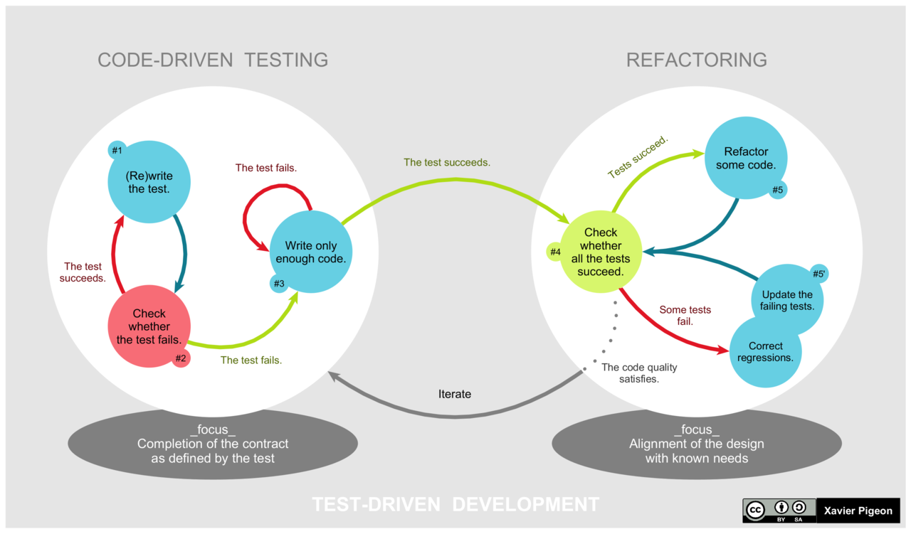

A short introduction
==================================

   *Test-driven development (TDD) is a software development process
   relying on software requirements being converted to test cases 
   before software is fully developed, and tracking all software 
   development by repeatedly testing the software against all test
   cases.*

   -- `Wikipedia TDD`_

What is TDD
----------------------------------

In few words, the idea is to design the user requirements (between 
other things) in the shape of code (tests functions). After a 
specific functionality we might think is completed, we would run the
test related to. If the tests pass, the requirement is fulfilled, if
not, there is still work to do.

But, in order to get to that point, in this tutorial we will guide
you step by step so you can understand the principles of testing and
how to create simple and reliable code in Python. Note one of the
critical points of TDD is to write clear and understandable tests 
that anyone can understand and maintain. Otherwise, soon or later
you will end up with a list of requirements that are really 
dangerous to change or delete when you are thinking about software
upgrades.

Unit vs Functional testing
----------------------------------

When looking into the internet, one might become overwhelmed about
how many concepts and possibilities are indeed for testing. And that
might drive the user to a lot of questions about what and how the 
test have to be designed, specially in the context of TDD.

For example in python, you might start asking where you should place
the test functions. After some time you might find out that although
it is free and flexible, depending on the framework you are using the
answer might be different. In that moment the next question is which
framework you should used and which is the best to start with.

As you can see it is not easy, but for now let's assume that there
are 2 types of tests:

:Unit test:       Ensures that a section of an application (known as 
                  the "unit") behaves as intended.
:Functional test: Testing that bases its test cases on the 
                  specifications of the software component under test.

In this tutorial, we will go through the differences of both tests
using practical examples and at the same time show you how to use  
2 of the most important testing frameworks in Python and learn in 
which context you should use each of them.

White-Box vs Black-Box testing
----------------------------------

Although it might seem the same that unit and functional tests, the
definition are a bit different:

:White-Box test: Tests internal structures or workings of an 
                 application.
:Black-Box test: Examines the functionality of an application without
                 peering into its internal structures or workings.

However as my personal recommendation (as you will see during this 
tutorial), try to keep the maximum similitude between Unit/White-Box
tests and Functional/Black-Box tests. This way you will benefit from
all the advantages between the two worlds.

At the end of the tutorial you will notice how similar both concepts
can be. 

Before starting this tutorial
----------------------------------

Although we will try to start from the bottom, there are some basics
I expect you to already have:

:Python:    This is a TDD guide for Python programming. Although the
            TDD theory can be applied to other programming languages,
            the frameworks and project structure are oriented to 
            python projects, which might not be similar to other
            programming languages or development methodologies. 

:git basic: The tutorial is divided in stages which are represented 
            by git branches you will have to change. This way you can
            implement your code meanwhile reading this tutorial and
            if you get lost or do something unexpected you can always
            reset your changes.

See also
----------------------------------

For more detail about the theory, I recommend you to visit this link 
at the `Wikipedia TDD`_. Although Wikipedia is not an official 
source, this specific link (or at least at 2021) has good enough
information to get a solid idea. Although I encourage you really to 
finish this tutorial. 

To understand better the reason why there are so many test 
differences, I recommend you you read this `article by Kent Beck`_.

.. _`Wikipedia TDD`: https://en.wikipedia.org/wiki/Test-driven_development
.. _`article by Kent Beck`: https://timsdevblog.wordpress.com/2015/03/30/kent-beck-on-tdd/

