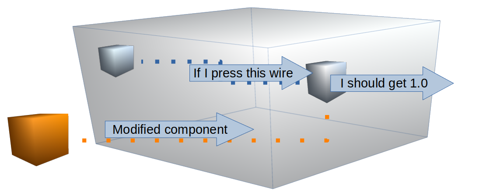

Unit testing
===================

Although for TDD normally one would start defining the functional 
tests, for the sake of simplicity we will start with some basics, and
unit testing is the best place for it.

So time to start working on our application. Let's open the terminal
and switch to the first branch for this tutorial `tdd-unittest`.

.. code-block:: shell 

    $ git checkout tdd-unittest

Our database example
----------------------------------

If we take a fast look into the repository we will find a lot of 
(useful but not relevant for now) files. However, for unit testing
we will focus our attention into the package folder, here named as
**template**. Lets make a `tree` command to see what it is inside:

.. code-block:: shell

    $ tree template
    template
    ├── __init__.py
    ├── module.py   # <-- Package module with some functions
    └── test        # <-- Folder for our unit tests
        ├── __init__.py
        └── test_module.py # <-- Test functions for module.py

    1 directories, 5 files

As first look we see as any normal python package it contains an 
**__init__** file to initialize the package, some modules with the
functions to provide the tools to the user and a **test** folder
where the package test modules and functions should be placed.

For this tutorial, you have to focus on the test code, therefore
we have taken the liberty to make the functions to test ourselves.

If we take a look inside **template/module.py** you will find the
following class and methods:

.. code-block:: python 

    class Database:
        """Simple class database with interface example"""

        def __init__(self):
            ...

        def __str__(self):
            ...

        @property
        def size(self):
            """Returns the number of keys stored in the database."""
            ...

        @property
        def keys(self):
            """Returns the stored keys in the database."""
            ...

        def add(self, key, value):
            """Adds a key-value to the database."""
            ...

        def get(self, key):
            """Gets the value from a specific key in the database."""
            ...

        def delete(self, key):
            """Deletes a specific key-value from the database."""
            ...

        def save(self, path):
            """Saves the database in a specific file."""
            ...

        def load(self, path):
            """Loads the database from a specific file."""
            ...

It is not the best database you will find in the market but it is the
perfect example to start defining our tests.

Unittest for simple tests
----------------------------------

Unittest is the perfect framework to test code 'units'. It ships with
Python by default, its usage is very simple and the tests definitions
keep quite short.

Back to our case, I would recommend to create one test module per 
each package module inside the self test package folder. This way is
easy to identify fast which tests are designed to test which part of
code. A more complete example would be:

.. code-block:: shell

    $ tree my_package
    my_package
    ├── __init__.py
    ├── my_module1.py # <-- Package module with some functions
    ├── my_module2.py # <-- Package module with some functions
    ├── my_module3.py # <-- Package module with some functions
    ├── my_module4.py # <-- Package module with some functions
    ├── ...
    └── test          # <-- Folder for our unit tests
        ├── __init__.py
        ├── test_my_module1.py # <-- Test functions for module1.py
        ├── test_my_module2.py # <-- Test functions for module2.py
        ├── test_my_module3.py # <-- Test functions for module3.py
        ├── test_my_module4.py # <-- Test functions for module4.py
        └── ...

Therefore, as mentioned before we will place the unit tests for
**module.py** in the same package on **test/test_module.py**.

Once we have created our test file, the second step is to identify
the minimal **code units**; Module and class methods that implement
the most atomic and minimal action inside the application.

For example, the method **add** inside the **Database** class
performs a very clear and isolated action, which is to add a 
key-value inside the database. Therefore our test should test 
exactly that, perform the **add** method and see immediately 
afterwards that the key and value are inside the database.

With the hands on the code, lets create a simple test:

.. code-block:: python 

    import unittest
    from template import module

    class TestsGroup001(unittest.TestCase):

        def setUp(self):
            database = module.Database()
            database._dict = {'a': 1, 'b': 2}
            self.db = database

        def test_add_key_value(self):
            self.assertEqual(self.db.add('c', 1), None)
            self.assertEqual(self.db._dict, {'a': 1, 'b': 2, 'c': 1})

Now, let's pay attention to what is going here. First we have to 
**import** the **unittest** framework and the **module** we want 
to test:

.. code-block:: python 

    import unittest
    from template import module

Then, according to the unittest framework, we define the tests
following some object and naming conventions:

    A testcase is created by **subclassing unittest.TestCase**. The
    individual tests are defined with methods whose names 
    **start with the letters test**. This naming convention informs 
    the test runner about which methods represent tests.

    -- unittest_ framework

.. code-block:: python 

    ...
    class TestsGroup001(unittest.TestCase):
        ...
        def test_add_key_value(self):
            self.assertEqual(self.db.add('c', 1), None)
            self.assertEqual(self.db._dict, {'a': 1, 'b': 2, 'c': 1})

However, our test do not contain a database object to test yet, 
therefore we have to create it before the assert functions. But
to avoid coping an pasting this step in all future tests, let's
use a "setUp":

.. code-block:: python 

    ...
    class TestsGroup001(unittest.TestCase):
        def setUp(self):
            database = module.Database()
            database._dict = {'a': 1, 'b': 2}
            self.db = database

This function will be performed once for each test defined inside the
test class (TestGroup001 here). There are also "tearDown", 
"setUpClass", "setDownClass" and much more functions that can provide
you with some extra tools to prepare the tests before running 
avoiding so to repeat code in each test case. Take a look into 
unittest_ module documentation to find more about all the options.

.. _unittest: https://docs.python.org/3/library/unittest.html

Keep simple with White-Box
----------------------------------

At this moment you would have probably notice that we have accessed
to a private variable of our Database in our TestCase "setUp". 

.. code-block:: python 
    :emphasize-lines: 5

    ...
    class TestsGroup001(unittest.TestCase):
        def setUp(self):
            database = module.Database()
            database._dict = {'a': 1, 'b': 2}
            self.db = database

Why to edit the private class and not to use the standard methods for
it? One of the advantages of White-Box vs Black-Box is that you can
test a specific function without depending on other function or the
same function itself.

.. code-block:: python 

    import unittest

    def bad_method():
        raise Exception("Here is a bug")
        return true 

    class TestsGroup(unittest.TestCase):
        def setUp(self):
            bad_method()
        def test_raises_an_ERROR(self):
            self.assertTrue(bad_method())
        def test_I_was_innocent():
            self.assertTrue(True)

This would execute as:

.. code-block:: shell 

    >>> unittest.main()
    EE
    ======================================================================
    ERROR: test_I_was_innocent (__main__.TestsGroup)
    ----------------------------------------------------------------------
    Traceback (most recent call last):
    File "<stdin>", line 3, in setUp
    File "<stdin>", line 2, in bad_method
    Exception: Here is a bug

    ======================================================================
    ERROR: test_raises_an_ERROR (__main__.TestsGroup)
    ----------------------------------------------------------------------
    Traceback (most recent call last):
    File "<stdin>", line 3, in setUp
    File "<stdin>", line 2, in bad_method
    Exception: Here is a bug

    ----------------------------------------------------------------------
    Ran 2 tests in 0.000s

If I would use the method "add" on the "setUp" to create my initial 
database status, then the "setUp" would depend on that the "add" 
method is working. Therefore if there is a bug in my "add" method,
unittest will complain that all tests are failing at "setUp" instead
of directing me to the test function "test_add_key_value". 

The main idea behind unit testing is to test the smallest *units* of
the application code one by one isolating them from each other.

    A unit test runs fast and has a small number of reasons it could 
    fail. When a unit test fails, it points an accusing finger at a 
    small part of the program.

    -- `Kent Beck`_

.. _`Kent Beck`: https://timsdevblog.wordpress.com/2015/03/30/kent-beck-on-tdd/

This is specially powerful (as we have seen) when combined with a
White-Box methodology where you can replace and mockup specific 
components or internal variables of the code.

With white-box testing you can use the structure of the code to 
identify classes of equivalent inputs avoiding so wasted tests. 

Identifying all code units
---------------------------------

Now we have our first TestCase, let's identify mode **code units** 
inside our template module: With a detailed look into our 
*Database class* we can find several class methods, each of them
taking some inputs and producing outputs:

- **add**: Adds a key-value to the database.
- **get**: Gets the value from a specific key in the database.
- **delete**: Deletes a specific key-value from the database.
- **save**: Saves the database in a specific file.
- **load**: Loads the database from a specific file.
        
Properties can also be target of **code units**:

- **size**: Returns the number of keys stored in the database.
- **keys**: Returns the stored keys in the database.

Magic objects and attributes can also be considered **code units**
as they modify functions from the parent class (so need also their
test functions)

- **__init__**: Constructor to initialize the attributes of the class.
- **__str__**: Creates the class object representation as a string.

However, "magic" objects are use to have special features which make
them complex to test or on the other hand very useful. In this example,
note that **__str__** can be used as a debugging tool when the members 
of a class need to be checked or that **__init__** would usually be 
call when we want to test any of the other code units.

New class for new setup
---------------------------------

Before going into the code, now we have identified all **code units**
we need to group them to avoid repeating code. There will be units 
which will have some a common "setUp" so can be located under the
same TestCase. Note the setUp() and tearDown() methods allow you to
define instructions that will be executed before and after each test 
method.

    *Tests can be numerous, and their set-up can be repetitive. 
    Luckily, we can factor out set-up code by implementing a method 
    called setUp(), which the testing framework will automatically 
    call for every single test we run.*

    -- unittest_ framework 

As we have already implemented a TestCase with a "setUp" function,
let's see which units can be integrated inside:

============  ========  =============================================
 Method        OK/NOK    Comments
============  ========  =============================================
**__init__**    N/A       Already used it setUp.
**__str__**      OK       
**size**         OK       
**keys**         OK       
**add**          OK       Already implemented.
**get**          OK       
**delete**       OK       
**save**        NOK       Needs specific tearDown to delete file.
**load**        NOK       Needs an already existing file to load.
============  ========  =============================================

Having identify the tests that might use the already defined "setUp"
we just need to add them inside the class specification:

.. code-block:: python 

    class TestsGroup001(unittest.TestCase):
        """Group to test the main database calls."""

        def setUp(self):
            database = module.Database()
            database._dict = {'a': 1, 'b': 2}
            self.db = database

        def test_str(self):
            self.assertEqual(str(self.db), "a:1\nb:2")

        def test_property_size(self):
            self.assertEqual(self.db.size, 2)

        def test_property_keys(self):
            self.assertEqual(self.db.keys, ['a', 'b'])

        def test_add_key_value(self):
            self.assertEqual(self.db.add('c', 1), None)
            self.assertEqual(self.db._dict, {'a': 1, 'b': 2, 'c': 1})

        def test_get_key_value(self):
            self.assertEqual(self.db.get('a'), 1)
            self.assertEqual(self.db.get('b'), 2)

        def test_delete_key(self):
            self.assertEqual(self.db.delete('a'), None)
            self.assertEqual(self.db._dict, {'b': 2})

Now for the 2 remaining methods, we can appreciate that we would need
a different "setUp" and even a "tearDown" for each them. In the case 
of **save**, we could reuse the "setUp" from TestsGroup001, however,
the "tearDown" to delete the generated file after the test would 
fail for the rest of test cases. 

Therefore a new TestCase for **save** is needed:

.. code-block:: python 

    class TestsGroup002(unittest.TestCase):
        """Group to test the saving of the database."""

        def setUp(self):
            database = module.Database()
            database._dict = {'a': 1, 'b': 2}
            self.db = database

        def tearDown(self):
            os.remove("test_db1.mydb")

        def test_save_db(self):
            self.assertNotIn("test_db1.mydb", os.listdir())
            self.assertEqual(self.db.save("test_db1.mydb"), None)
            self.assertIn("test_db1.mydb", os.listdir())

An also a new TestCase for **load** where a file is generated before
running the test:

.. code-block:: python 

    class TestsGroup003(unittest.TestCase):
        """Group to test the correct loading of a database."""

        def setUp(self):
            database = module.Database()
            database._dict = {'a': 1, 'b': 2}
            database.save("test_db2.mydb")

        def tearDown(self):
            os.remove("test_db2.mydb")

        def test_load_db(self):
            db = module.Database()
            self.assertEqual(db.load("test_db2.mydb"), None)
            self.assertEqual(db._dict, {'a': 1, 'b': 2})

Note that we have used different names for the generated files 
"test_db1.mydb" and "test_db2.mydb". Normally, you want to run
the test in parallel to speed up the testing process, but that
might lead to 2 "setUp" process trying to generate, delete or
even access the file at the same time, which normally leads to
unexpected race conditions and errors.

How to run my unit tests
----------------------------------

Now we have finished creating our tests with probably a good coverage
result, it is time to run unittest and see if all the test are 
passing.

To run the tests from the shell, you only need to call the unittest
module using `$python -m unittest`, however you can add the command 
option `--verbose` to display more information about the tests:

.. code-block:: shell 

    $ python -m unittest -v
    test_add_key_value (template.test.test_module.TestsGroup001)
    Tests the method to add a key value. ... ok
    test_delete_key (template.test.test_module.TestsGroup001)
    Tests the method to delete a key ... ok
    test_get_key_value (template.test.test_module.TestsGroup001)
    Tests the method to get a key value. ... ok
    test_property_keys (template.test.test_module.TestsGroup001)
    Tests the property keys. ... ok
    test_property_size (template.test.test_module.TestsGroup001)
    Tests the property size. ... ok
    test_str (template.test.test_module.TestsGroup001)
    Tests the string method. ... ok
    test_save_db (template.test.test_module.TestsGroup002)
    Tests the method to delete a key ... ok
    test_load_db (template.test.test_module.TestsGroup003)
    Tests the method to delete a key ... ok

    ----------------------------------------------------------------------
    Ran 8 tests in 0.001s

    OK

If you do not get the **OK** at the end of the command execution, it
means some of your tests have failed. Try to follow the unittest 
instructions to fix the issue or review this tutorial from the 
beginning until all your unit tests pass.

Don't drink too much kool-aid
----------------------------------

If you take a deep look into the code now, you will start feeling 
that you are repeating yourself at the "setUp" of each TestCase.

Think now that you want check that your tests pass with a different
database state of key-values. Then you have to create a different
TestCase with the specific setUp (if you want to follow the framework
rules):

.. code-block:: python 

    class TestsGroup001(unittest.TestCase):
        def setUp(self):
            database = module.Database()
            database._dict = {'a': 1, 'b': 2}
            self.db = database 
        ...

    class TestsGroup002(unittest.TestCase):
        def setUp(self):
            database = module.Database()
            database._dict = {'x': 1, 'y': 5}
            self.db = database
        ...

    class TestsGroup003(unittest.TestCase):
        def setUp(self):
            database = module.Database()
            database._dict = {'-': 1, '*': -1}
            self.db = database
        ...

The biggest limitation of unittest_ framework is its simplicity.

If you want to create complex and parametrized setUp stages to test
all your multiple combinations of possible inputs and outputs you
will find your self with a really complex code with some things that
cannot be actually done.

This cases are just in the limit of the unit testing scope, therefore
when things get really complex you should ask your self if your are
actually doing is to perform functional testing.
